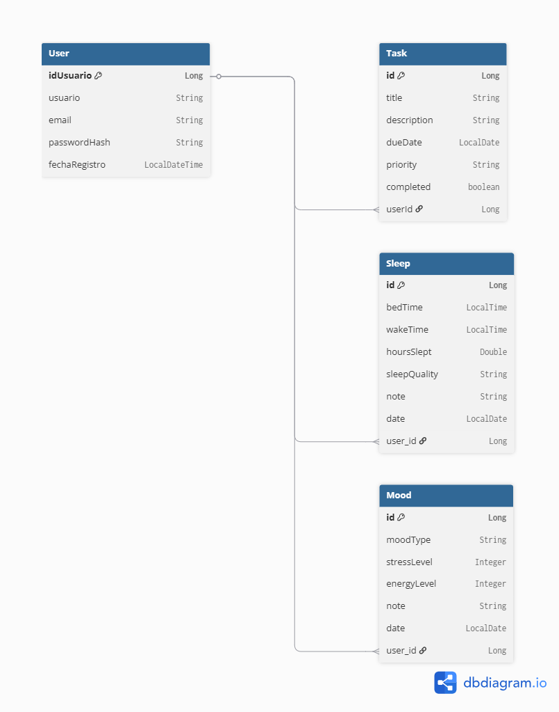
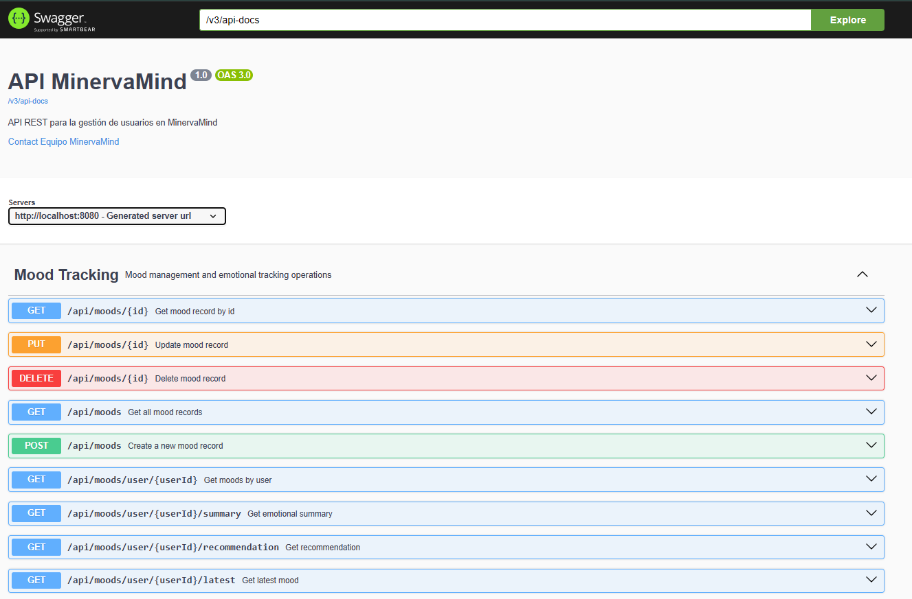
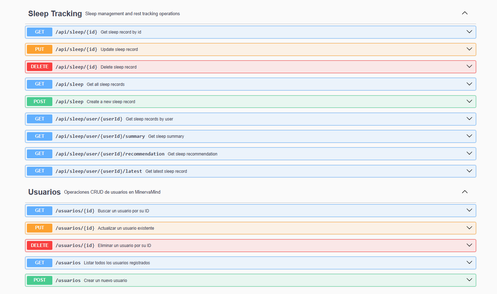
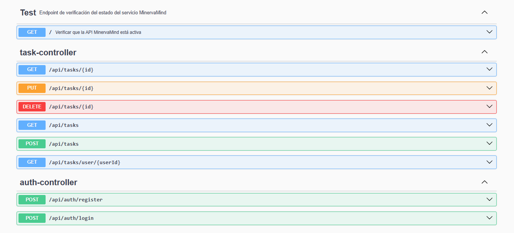
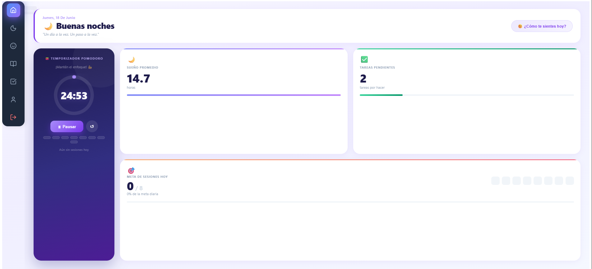
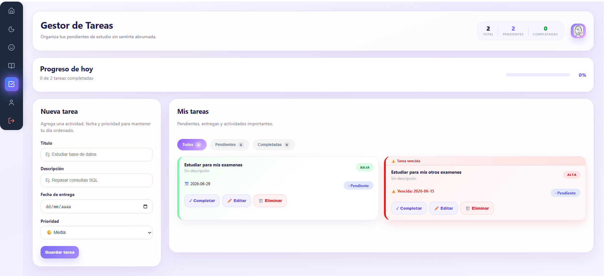
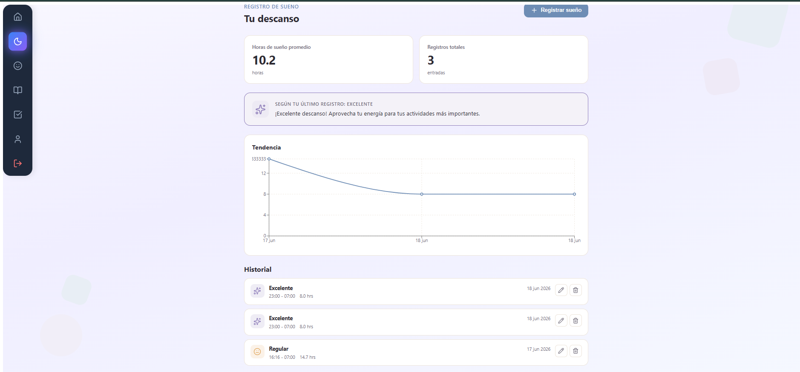

# MinervaMind: Estudio Inteligente, Mente Sana

---

## 1. Descripción del Proyecto

**MinervaMind** es una solución tecnológica diseñada específicamente para el entorno universitario, donde la carga académica suele desplazar el cuidado personal. Esta plataforma web permite a los estudiantes organizar sus jornadas de estudio de manera eficiente, integrando un seguimiento de hábitos de bienestar como el ciclo de sueño y el estado anímico.

El proyecto surge como una respuesta al *burnout* académico, buscando que el éxito en materias del ciclo no sea a costa de la salud mental. A través de un enfoque minimalista y funcional, MinervaMind ayuda a identificar patrones de conducta, fomentando una disciplina saludable que equilibra la productividad con el descanso necesario.

**Funciones Principales:**
- **Gestión de Tareas:** Creación, edición y seguimiento de tareas académicas y recordatorios.
- **Temporizador Pomodoro:** Herramienta para mantener el enfoque durante sesiones de estudio con intervalos de descanso cortos.
- **Registro de Sueño:** Seguimiento de horas dormidas y calidad del sueño para generar promedios y recomendaciones.
- **Registro de Estado de Ánimo:** Monitoreo diario del nivel de estrés, energía y humor general.
- **Dashboard Personalizado:** Vista unificada con métricas y atajos para conocer tu estado general en un vistazo.

---

## 2. Diagrama Entidad-Relación (DER)

El siguiente diagrama ilustra la estructura principal de la base de datos de MinervaMind



---

## 3. Manual de Despliegue

> pendiente

### Requisitos Previos
- Node.js (v18+)
- Java 17+ (JDK)
- PostgreSQL (Corriendo localmente en el puerto 5432)

### Pasos para ejecución local

1. **Base de Datos:**
   Asegúrate de tener PostgreSQL instalado y en ejecución. Crea una base de datos llamada `minervamind`.
   ```bash
   # Las credenciales por defecto están en src/main/resources/application-postgres.properties
   ```

2. **Levantar el Backend (Spring Boot):**
   Abre una terminal en la raíz del proyecto y ejecuta:
   ```bash
   cd backend
   ./mvnw spring-boot:run
   ```
   El backend estará disponible en `http://localhost:8080`.

3. **Levantar el Frontend (React/Vite):**
   Abre una nueva terminal, navega a la carpeta del frontend y ejecuta:
   ```bash
   cd frontend
   npm install
   npm run dev
   ```
   La aplicación web estará disponible en `http://localhost:5173`.

---

## 4. Evidencias de Funcionamiento

### A. Documentación en Swagger






### B. Tabla de Rutas (Endpoints) del Backend

A continuación se listan los endpoints funcionales del backend:

| Módulo | Método | Endpoint | Descripción |
| :--- | :--- | :--- | :--- |
| **Autenticación** | `POST` | `/api/auth/login` | Inicia sesión y devuelve un token JWT. |
| **Autenticación** | `POST` | `/api/auth/register` | Registra un nuevo usuario en la plataforma. |
| **Usuarios** | `GET` | `/usuarios` | Obtiene la lista de todos los usuarios. |
| **Usuarios** | `GET` | `/usuarios/{id}` | Obtiene un usuario específico por su ID. |
| **Usuarios** | `POST` | `/usuarios` | Crea un nuevo usuario. |
| **Usuarios** | `PUT` | `/usuarios/{id}` | Actualiza la información de un usuario. |
| **Usuarios** | `DELETE` | `/usuarios/{id}` | Elimina un usuario. |
| **Tareas** | `GET` | `/api/tasks` | Obtiene todas las tareas registradas. |
| **Tareas** | `GET` | `/api/tasks/user/{userId}` | Obtiene todas las tareas de un usuario en específico. |
| **Tareas** | `GET` | `/api/tasks/{id}` | Obtiene los detalles de una tarea específica. |
| **Tareas** | `POST` | `/api/tasks` | Crea una nueva tarea. |
| **Tareas** | `PUT` | `/api/tasks/{id}` | Actualiza el estado o detalle de una tarea. |
| **Tareas** | `DELETE` | `/api/tasks/{id}` | Elimina una tarea. |
| **Sueño** | `GET` | `/api/sleep/user/{userId}` | Obtiene el historial de registros de sueño de un usuario. |
| **Sueño** | `GET` | `/api/sleep/user/{userId}/summary` | Obtiene el promedio de horas y estadísticas de sueño. |
| **Sueño** | `GET` | `/api/sleep/user/{userId}/latest` | Obtiene el último registro de sueño ingresado. |
| **Sueño** | `GET` | `/api/sleep/user/{userId}/recommendation` | Genera una recomendación de descanso. |
| **Sueño** | `POST` | `/api/sleep` | Crea un nuevo registro de sueño. |
| **Sueño** | `PUT` | `/api/sleep/{id}` | Edita un registro de sueño existente. |
| **Sueño** | `DELETE` | `/api/sleep/{id}` | Elimina un registro de sueño. |
| **Ánimo** | `GET` | `/api/moods/user/{userId}` | Obtiene el historial de estados de ánimo del usuario. |
| **Ánimo** | `GET` | `/api/moods/user/{userId}/summary` | Obtiene un resumen del estrés y energía promedio. |
| **Ánimo** | `POST` | `/api/moods` | Crea un nuevo registro de estado de ánimo. |
| **Ánimo** | `PUT` | `/api/moods/{id}` | Actualiza un registro de estado de ánimo existente. |
| **Ánimo** | `DELETE` | `/api/moods/{id}` | Elimina un registro de estado de ánimo. |

### C. Capturas de las Vistas (Frontend)

**Dashboard Principal:**


**Registro de Tareas:**


**Seguimiento de Sueño y Estado de Ánimo:**


---

## 5. Equipo de Desarrollo

| Nombre Completo | Carnet | Rol Principal | GitHub |
| :--- | :---: | :--- | :--- |
| **Daniel Abraham Cerritos Rivera** | CR24054 | Frontend / Líder | [@CR24054](https://github.com/cr24054) |
| **Christopher Bryan Rodriguez Medina** | RM21062 | Backend / DB | [@CrisMdn01](https://github.com/CrisMdn01) |
| **Nayeli Sarai Santos Hernandez** | SH24001 | Backend | [@sh24001-code](https://github.com/sh24001-code) |
| **Oscar Ernesto Rivas Salguero** | RS0821 | Frontend | [@RS08021](https://github.com/rs08021) |


---
